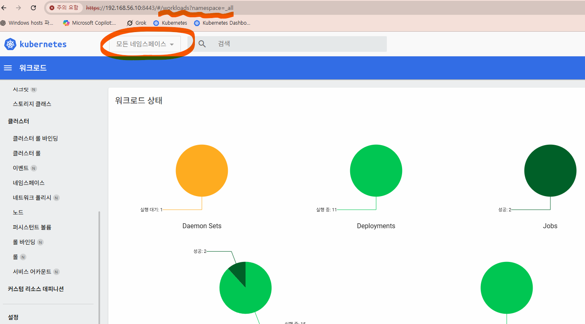
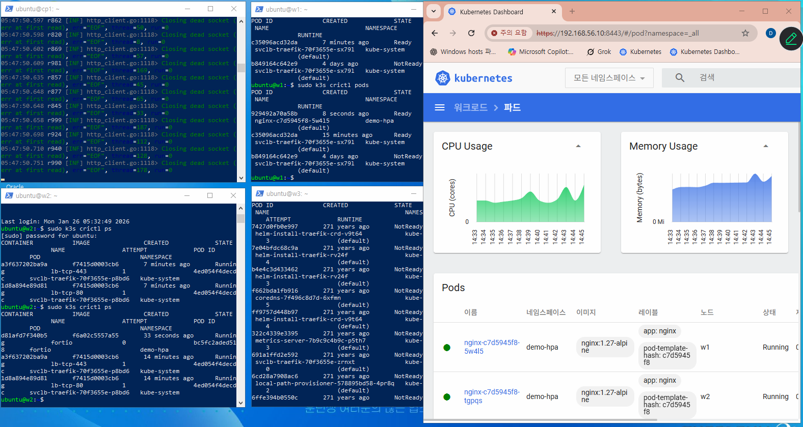
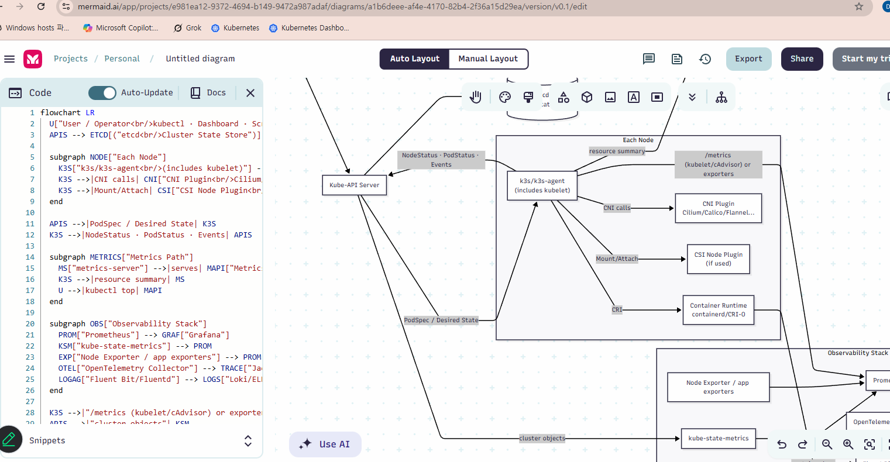
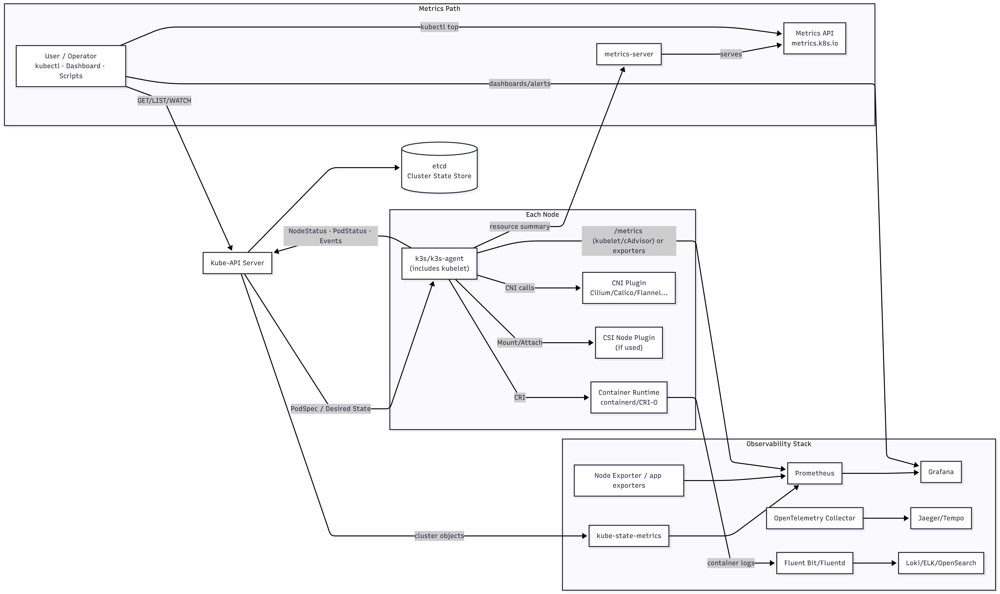
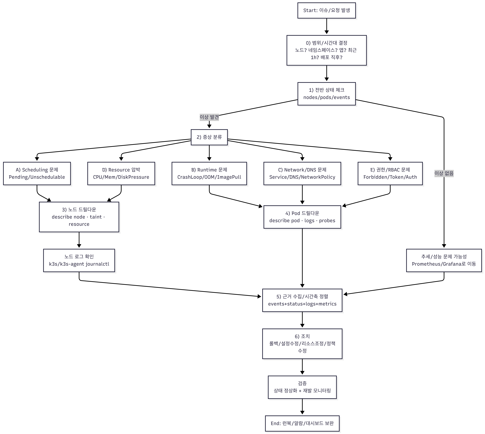
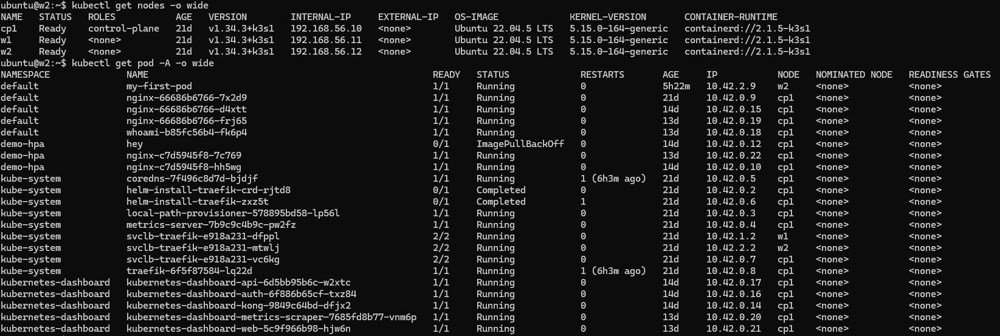

# Kubernetes에서 Pod와 Node의 차이점

> 통합본: `7. Node_Pod.md` + `7.3 Kubernetes Pod 상태.md`

## 기존 문서 1

## 현행 분석
### Node 추가 , DashBoard 실행




## Node, Pod 의 상태 파악 도식화
### 1) Node/Pod 정보 게더링 전체 흐름(아키텍처)

```Mermaid
flowchart LR
  U["User / Operator<br/>kubectl · Dashboard · Scripts"] -->|GET/LIST/WATCH| APIS["Kube-API Server"]
  APIS --> ETCD[("etcd<br/>Cluster State Store")]

  subgraph NODE["Each Node"]
    K3S["k3s/k3s-agent<br/>(includes kubelet)"] -->|CRI| CRI["Container Runtime<br/>containerd/CRI-O"]
    K3S -->|CNI calls| CNI["CNI Plugin<br/>Cilium/Calico/Flannel..."]
    K3S -->|Mount/Attach| CSI["CSI Node Plugin<br/>(if used)"]
  end

  APIS -->|PodSpec / Desired State| K3S
  K3S -->|NodeStatus · PodStatus · Events| APIS

  subgraph METRICS["Metrics Path"]
    MS["metrics-server"] -->|serves| MAPI["Metrics API<br/>metrics.k8s.io"]
    K3S -->|resource summary| MS
    U -->|kubectl top| MAPI
  end

  subgraph OBS["Observability Stack"]
    PROM["Prometheus"] --> GRAF["Grafana"]
    KSM["kube-state-metrics"] --> PROM
    EXP["Node Exporter / app exporters"] --> PROM
    OTEL["OpenTelemetry Collector"] --> TRACE["Jaeger/Tempo"]
    LOGAG["Fluent Bit/Fluentd"] --> LOGS["Loki/ELK/OpenSearch"]
  end

  K3S -->|"/metrics (kubelet/cAdvisor) or exporters"| PROM
  APIS -->|"cluster objects"| KSM
  CRI -->|"container logs"| LOGAG
  U -->|"dashboards/alerts"| GRAF
```




### 2) “게더링 → 분석” 운영 절차(플로우)
```Mermaid
flowchart TD
  S["Start: 이슈/요청 발생"] --> SCOPE["0) 범위/시간대 결정<br/>노드? 네임스페이스? 앱? 최근 1h? 배포 직후?"]
  SCOPE --> H1["1) 전반 상태 체크<br/>nodes/pods/events"]
  H1 -->|이상 없음| H2["추세/성능 문제 가능성<br/>Prometheus/Grafana로 이동"]
  H1 -->|이상 발견| CLASSIFY["2) 증상 분류"]

  CLASSIFY --> PENDING["A) Scheduling 문제<br/>Pending/Unschedulable"]
  CLASSIFY --> CRASH["B) Runtime 문제<br/>CrashLoop/OOM/ImagePull"]
  CLASSIFY --> NET["C) Network/DNS 문제<br/>Service/DNS/NetworkPolicy"]
  CLASSIFY --> RES["D) Resource 압박<br/>CPU/Mem/DiskPressure"]
  CLASSIFY --> AUTH["E) 권한/RBAC 문제<br/>Forbidden/Token/Auth"]

  PENDING --> NODES["3) 노드 드릴다운<br/>describe node · taint · resource"]
  RES --> NODES
  NODES --> NODELOG["노드 로그 확인<br/>k3s/k3s-agent journalctl"]
  NODELOG --> EVIDENCE["5) 근거 수집/시간축 정렬<br/>events+status+logs+metrics"]

  CRASH --> PODS["4) Pod 드릴다운<br/>describe pod · logs · probes"]
  NET --> PODS
  AUTH --> PODS
  PODS --> EVIDENCE

  H2 --> EVIDENCE

  EVIDENCE --> FIX["6) 조치<br/>롤백/설정수정/리소스조정/정책수정"]
  FIX --> VERIFY["검증<br/>상태 정상화 + 재발 모니터링"]
  VERIFY --> END["End: 런북/알람/대시보드 보완"]
```


### 3) 다이어그램과 1:1로 매칭되는 “핵심 수집 명령” (붙여두면 편함)
#### (1) 전반 상태

```
kubectl get nodes -o wide
kubectl get pod -A -o wide
```


---

```
kubectl get events -A --sort-by=.lastTimestamp | tail -n 200
```

### 위의 **events는 리눅스 명령이 아니라 kubectl의 서브커맨드(리소스 타입)**예요.
#### 명령을 분해하면 이렇게 됩니다:
##### kubectl : Kubernetes CLI
##### get : 리소스를 조회하는 동사
##### events : 조회할 Kubernetes 리소스 종류(Event 리소스)
##### -A : 모든 네임스페이스(all namespaces)
##### --sort-by=.lastTimestamp : 출력 결과를 JSON 경로 기준으로 정렬(마지막 타임스탬프)
##### | : 리눅스 파이프(앞 명령 출력 → 뒤 명령 입력)
##### tail -n 200 : 리눅스 명령 tail로 마지막 200줄만 보기
#### 즉, 이 전체 명령에서 **리눅스 자체 명령은 tail과 파이프(|)**이고, events는 Kubernetes의 Event 리소스를 의미합니다.

---

## Kubernetes Event 리소스의 역할

Kubernetes에서 **Event**는 “클러스터에서 일어난 중요한 사실(무슨 일이 있었는지)”을 **짧게 기록해 주는 알림/기록 리소스**입니다.  
주로 **문제 원인 추적(트러블슈팅)** 할 때 가장 먼저 보는 힌트가 됩니다.

---

## 1) Event가 하는 역할

- **Pod/Deployment/Node 등 리소스에 대해 발생한 변화나 실패를 기록**
  - 스케줄링 성공/실패(예: `FailedScheduling`)
  - 이미지 풀 실패(예: `Failed to pull image`)
  - 컨테이너 재시작/크래시(예: `Back-off restarting failed container`)
  - 노드 이상/리소스 부족(예: `NodeNotReady`, `Insufficient cpu`)
  - 볼륨 마운트 실패, 프로브 실패(Readiness/Liveness), 권한 문제 등
- “로그(log)”처럼 긴 내용이 아니라, **요약된 사건/사유 + 관련 오브젝트** 중심
- 특정 오브젝트(`involvedObject`)에 **붙는 형태**라서, `kubectl describe pod ...` 할 때 아래쪽에 **Events**가 같이 나옵니다.

---

## 2) 언제 가장 유용하나

- Pod이 **Pending**에서 안 뜰 때  
  → `FailedScheduling` 이벤트로 이유가 바로 나옵니다(리소스 부족, taint/toleration, 노드 선택 등).
- Pod이 **ImagePullBackOff**일 때  
  → 레지스트리 인증/이미지명 오류/네트워크 문제 단서.
- Pod이 **CrashLoopBackOff**일 때  
  → 프로브 실패, OOMKilled, 시작 실패 등 “왜 반복 재시작인지” 힌트.
- Service/Ingress 연결 문제  
  → 엔드포인트 생성/변경, 컨트롤러가 남긴 이벤트 단서.

---

## 3) Event의 성격(중요한 특징)

- **영구 로그가 아님(짧게 보관됨)**  
  Event는 “최근 상황 파악용”이라 시간이 지나면 자동으로 사라질 수 있습니다(클러스터 설정에 따라 TTL/보관 정책 영향).
- **같은 일이 반복되면 count가 누적**되거나 유사 이벤트가 계속 생성됩니다.
- 일반적인 분석 흐름:  
  **Event로 방향 잡기 → `kubectl logs`로 앱 로그 확인 → 노드/컨트롤 플레인 로그 확인**.

---

## 4) 실무에서 자주 쓰는 조회 명령

```bash
