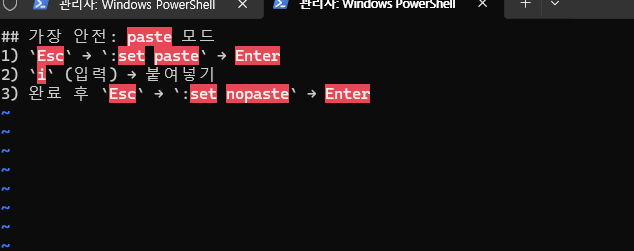

# vi에서 클립보드 내용을 “깨지지 않게” 정확히 붙여넣기

## 가장 안전: paste 모드
1) `Esc` → `:set paste` → Enter  
2) `i` (입력) → 붙여넣기  
3) 완료 후 `Esc` → `:set nopaste` → Enter

상태 확인:
```vim
:set paste?
```
### vi 에 붙여넣기 연습 화면

