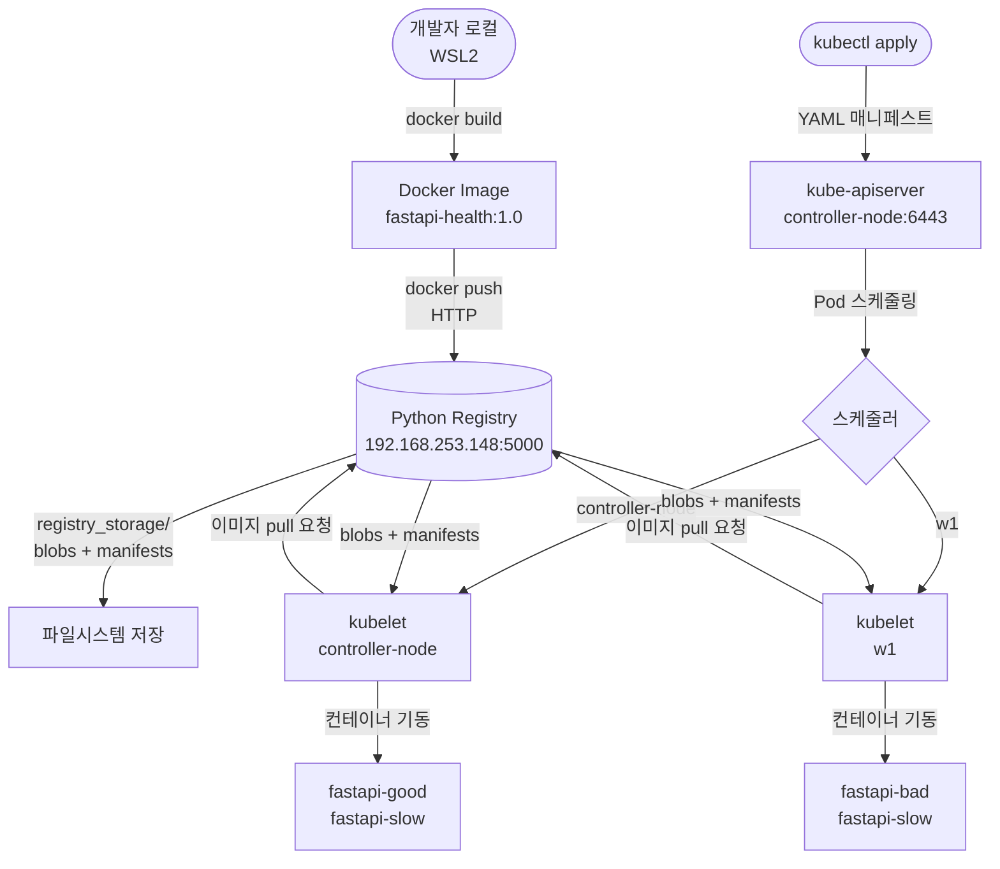
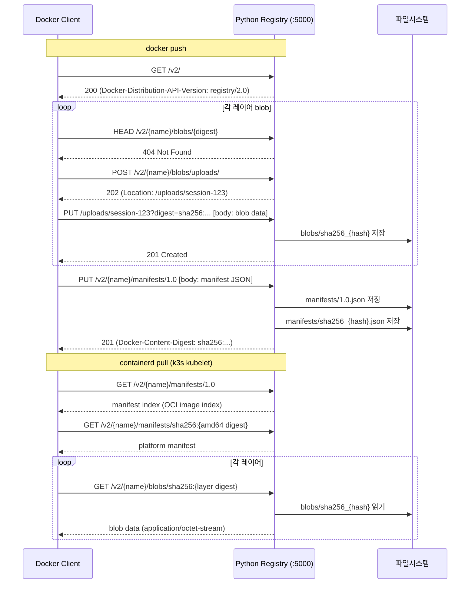

# 07 - Pods with YAML

YAML 매니페스트 기반 Pod 배포와 Liveness / Readiness / Startup Probe의 동작 원리를 실습하는 모듈입니다.
로컬 Python 컨테이너 레지스트리를 직접 구현하여 이미지 저장·배포 흐름 전체를 체험합니다.

---

## 강의 목표

- YAML 기반 Pod / Service 정의 및 적용 흐름 숙련
- livenessProbe / readinessProbe / startupProbe 세 가지 Probe의 차이와 장애 패턴 이해
- 커스텀 컨테이너 레지스트리를 통한 이미지 push → pull → 파드 기동 전체 흐름 체험

---

## 기술 스택

### 애플리케이션 (app/)

| 구분 | 기술 | 버전 | 역할 |
|------|------|------|------|
| 언어 | Python | 3.11 | 애플리케이션 런타임 |
| 웹 프레임워크 | FastAPI | 0.115.0 | REST API 서버 (`/`, `/healthz`, `/ready`) |
| ASGI 서버 | Uvicorn (standard) | 0.30.6 | HTTP 서버, 포트 8080 |
| 컨테이너 이미지 | python:3.11-slim | - | 베이스 이미지 |
| 환경 변수 | `SLOW_START`, `STARTUP_SLEEP` | - | 느린 기동 시나리오 제어 |

**엔드포인트**

| 경로 | 용도 |
|------|------|
| `GET /` | 기본 응답 (`{"msg": "hello"}`) |
| `GET /healthz` | livenessProbe / startupProbe 대상 |
| `GET /ready` | readinessProbe 대상 |

---

### 컨테이너 레지스트리 (my-registry/)

| 구분 | 기술 | 버전 | 역할 |
|------|------|------|------|
| 언어 | Python | 3.12 | 레지스트리 런타임 |
| 웹 프레임워크 | FastAPI | - | Docker Distribution API v2 구현 |
| ASGI 서버 | Uvicorn | - | HTTP 서버, 포트 5000 |
| 스토리지 | 로컬 파일시스템 | - | `registry_storage/` 디렉토리 |
| 프론트엔드 | TailwindCSS + Axios | CDN | 웹 UI (저장소·태그 조회) |
| 구현 스펙 | Docker Distribution API v2 | - | push / pull / catalog / tags |

---

### 인프라

| 구분 | 기술 | 버전 | 역할 |
|------|------|------|------|
| 컨테이너 오케스트레이션 | Kubernetes (k3s) | v1.35.5+k3s1 | Pod 스케줄링 및 Probe 실행 |
| 컨테이너 런타임 | containerd | 2.2.3-k3s1 | 이미지 pull 및 컨테이너 실행 |
| 클러스터 구성 | control-plane 1 + worker 1 | - | controller-node(149) / w1(148) |
| insecure registry | k3s registries.yaml | - | HTTP 레지스트리 허용 설정 |
| 네트워크 | k3s 내장 Flannel CNI | - | Pod 간 통신 |

---

### Kubernetes 매니페스트 (kube-manifests/)

| 파일 | 리소스 | 핵심 설정 | 실습 목적 |
|------|--------|-----------|-----------|
| `04-namespace.yml` | Namespace | `demo` | 격리 네임스페이스 생성 |
| `05-fastapi-pod-bad.yml` | Pod | livenessProbe port **9999** (틀린 포트) | CrashLoopBackOff 재현 |
| `06-fastapi-pod-good.yml` | Pod | livenessProbe + readinessProbe port **8080** | 정상 Probe 설정 |
| `07-fastapi-pod-slow.yml` | Pod | startupProbe + livenessProbe + readinessProbe | 느린 기동(30초) 보호 패턴 |
| `08-fastapi-svc.yml` | Service | ClusterIP | Pod 접근 엔드포인트 |

---

## Workflow

### 전체 이미지 빌드 → 배포 흐름



---

### Probe 동작 흐름

```mermaid
sequenceDiagram
    participant K as kubelet
    participant C as Container (FastAPI :8080)

    Note over K,C: 파드 기동

    rect rgb(40, 60, 80)
        Note over K: startupProbe 활성 (fastapi-slow)
        loop periodSeconds: 2 / failureThreshold: 20
            K->>C: GET /healthz
            C-->>K: 200 OK
        end
        Note over K: startupProbe 통과 → liveness/readiness 활성화
    end

    rect rgb(40, 80, 50)
        Note over K: livenessProbe 주기 체크
        loop periodSeconds: 10
            K->>C: GET /healthz
            C-->>K: 200 OK
        end
    end

    rect rgb(80, 50, 40)
        Note over K: fastapi-bad — 틀린 포트(9999)
        K->>C: GET /healthz :9999
        C-->>K: Connection Refused
        K->>C: GET /healthz :9999
        C-->>K: Connection Refused
        Note over K: failureThreshold 초과 → 컨테이너 Kill & Restart
    end
```



---

### 컨테이너 레지스트리 push / pull 내부 흐름



---

## 디렉토리 구조

```
07-PODs-with-YAML/
├── app/                        # FastAPI 애플리케이션
│   ├── main.py                 # /healthz /ready /  엔드포인트
│   ├── Dockerfile              # python:3.11-slim 기반, 포트 8080
│   ├── requirements.txt        # fastapi==0.115.0, uvicorn==0.30.6
│   └── build-push.sh           # 빌드 & 192.168.253.148:5000 push 스크립트
├── kube-manifests/             # Kubernetes 매니페스트
│   ├── 04-namespace.yml        # Namespace: demo
│   ├── 05-fastapi-pod-bad.yml  # livenessProbe 잘못된 포트 → CrashLoopBackOff
│   ├── 06-fastapi-pod-good.yml # 정상 liveness + readiness Probe
│   ├── 07-fastapi-pod-slow.yml # startupProbe로 느린 기동 보호
│   └── 08-fastapi-svc.yml      # ClusterIP Service
├── my-registry/                # 커스텀 Python 컨테이너 레지스트리
│   ├── registry.py             # Docker Distribution API v2 구현
│   └── README.md               # 레지스트리 상세 문서
├── theory-liveness-probe.md    # Probe 이론 정리
├── lab-liveness-probe-fastapi.md
└── tips-kubectl-explain.md
```

---

## 권장 실습 순서

1. `04-namespace.yml` 적용 — Namespace 생성
2. `build-push.sh` 실행 — 이미지 빌드 및 레지스트리 push
3. `05-fastapi-pod-bad.yml` 적용 → `kubectl describe` 로 CrashLoopBackOff 원인 분석
4. `06-fastapi-pod-good.yml` 적용 → 정상 Probe 동작 확인
5. `07-fastapi-pod-slow.yml` 적용 → startupProbe 없을 때 vs 있을 때 비교
6. `08-fastapi-svc.yml` 적용 → Service를 통한 Pod 접근

---

## 참고 문서

- [theory-liveness-probe.md](./theory-liveness-probe.md)
- [lab-liveness-probe-fastapi.md](./lab-liveness-probe-fastapi.md)
- [tips-kubectl-explain.md](./tips-kubectl-explain.md)
- [my-registry/README.md](./my-registry/README.md)
