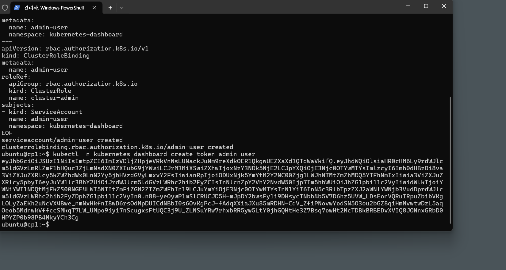

# 11 - Dashboard와 Observability


## 강의 목표
- Ingress/Metrics Server/Dashboard 구성
- 재접속/포트포워딩 복구 절차 숙련

## 포함 문서
- 4. dashboard.md
- 4.1 4번의 결과에 대한 분석.md
- 5. re-connect.md

## 권장 순서
1. dashboard 구성 문서 확인
2. 분석 문서로 코어/애드온 역할 정리
3. 재접속 가이드로 운영 절차 마무리

## 통합 문서 목록
- `4. dashboard.md`
- `4.1 4번의 결과에 대한 분석.md`
- `5. re-connect.md`

---


# 안 죽으면
sudo kill -9 <PID>
```

---

## 7) 로그인 토큰 생성 (학습용 관리자)

> ⚠️ 아래는 학습 편의용으로 **관리자 권한**을 줍니다. 운영 환경에서는 최소 권한으로 구성하세요.

`dash-admin.yaml`:
```yaml
apiVersion: v1
kind: ServiceAccount
metadata:
  name: admin-user
  namespace: kubernetes-dashboard
---
apiVersion: rbac.authorization.k8s.io/v1
kind: ClusterRoleBinding
metadata:
  name: admin-user
roleRef:
  apiGroup: rbac.authorization.k8s.io
  kind: ClusterRole
  name: cluster-admin
subjects:
- kind: ServiceAccount
  name: admin-user
  namespace: kubernetes-dashboard
```

적용 + 토큰:
```sh
kubectl apply -f dash-admin.yaml
kubectl -n kubernetes-dashboard create token admin-user
```



---

## 8) 상태 확인

```sh
kubectl -n kubernetes-dashboard get pods,svc
```
정상이라면 Pod들이 `Running`이고, 서비스에 `kubernetes-dashboard-kong-proxy`가 보입니다.
---
## 참고(원본 단서)
원문에는 Helm 설치/에러 원인(쿠버 설정 없음), Dashboard 설치 성공 로그, 그리고 port-forward 충돌(ssh가 127.0.0.1:8443 점유) 사례가 포함되어 있습니다.


---
## 현재 까지의 리소스에 대한 부연 설명
4.1 4번의 결과에 대한 분석.md

## Control Plane 에서 실행 명령 목록
```
   55  sudo apt update && sudo apt install -y curl
   56  curl -sfL https://get.k3s.io |   K3S_KUBECONFIG_MODE="644" sh -s -   --node-ip 192.168.56.10   --flannel-iface enp0s8
   57  sudo systemctl status k3s --no-pager -l
   58  kubectl
   59  kubectl get nodes -o wide
   60  sudo cat /var/lib/rancher/k3s/server/node-token
   61  kubectl get nodes -o wide
   62  kubectl get pods -A
   63  kubectl
   64  kubectl get pods -A
   65  kubectl get nodes -o wide
   66  kubectl -n kube-system get deploy,svc | egrep "traefik|metrics" || true
   67  kubectl -n kube-system get svc traefik -o wide
   68  kubectl create deploy whoami --image=traefik/whoami
   69  kubectl expose deploy whoami --port 80
   70  kubectl get pod -o wide
   71  ls -al
   72  pwd
   73  cd ~
   74  ls -al
   75  sudo vi ./ing-whoami.yaml
   76  ls -al
   77  sudo vi ./ing-whoami.yaml
   78  kubectl apply -f ing-whoami.yaml
   79  kubectl get ingress
   80  kubectl top nodes
   81  kubectl top pods -A | head
   82  kubectl -n kube-system get deploy metrics-server
   83  kubectl -n kube-system logs deploy/metrics-server --tail=50
   84  curl -fsSL https://raw.githubusercontent.com/helm/helm/main/scripts/get-helm-3 | bash
   85  helm repo add kubernetes-dashboard https://kubernetes.github.io/dashboard/
   86  helm repo update
   87  helm upgrade --install kubernetes-dashboard kubernetes-dashboard/kubernetes-dashboard   --create-namespace --namespace kubernetes-dashboard
   88  helm repo update
   89  curl -fsSL https://raw.githubusercontent.com/helm/helm/main/scripts/get-helm-3 | bash
   90  helm repo add kubernetes-dashboard https://kubernetes.github.io/dashboard/
   91  helm upgrade --install kubernetes-dashboard kubernetes-dashboard/kubernetes-dashboard   --create-namespace --namespace kubernetes-dashboard
   92  echo "KUBECONFIG=$KUBECONFIG"
   93  ls -al ~/.kube/config
   94  kubectl config current-context
   95  kubectl config view --minify
   96  sudo ls -al /etc/kubernetes/admin.conf
   97  sudo ls -al /etc/rancher/k3s/k3s.yaml
   98  # 1) ubuntu 유저 홈에 kubeconfig 설치
   99  mkdir -p ~/.kube
  100  sudo cp -i /etc/rancher/k3s/k3s.yaml ~/.kube/config
  101  mkdir -p ~/.kube
  103  sudo cp -i /etc/rancher/k3s/k3s.yaml ~/.kube/config
  104  sudo chown $(id -u):$(id -g) ~/.kube/config
  105  chmod 600 ~/.kube/config
  106  kubectl cluster-info
  107  kubectl get nodes
  108  kubectl get --raw /version
  109  helm repo add kubernetes-dashboard https://kubernetes.github.io/dashboard/
  110  helm repo update
  111  helm upgrade --install kubernetes-dashboard kubernetes-dashboard/kubernetes-dashboard   --create-namespace --namespace kubernetes-dashboard
  112  kubectl -n kubernetes-dashboard port-forward   svc/kubernetes-dashboard-kong-proxy 8443:443   --address 0.0.0.0
  ```


---


# 엔드포인트 확인
kubectl -n kubernetes-dashboard get endpoints


# 외부 접근 (port-forward)
kubectl -n kubernetes-dashboard port-forward svc/kubernetes-dashboard-kong-proxy 8443:443

---


## 참고 문서
- [guide-dashboard-setup.md](./guide-dashboard-setup.md)
- [guide-reconnect.md](./guide-reconnect.md)
- [theory-core-vs-addon.md](./theory-core-vs-addon.md)
