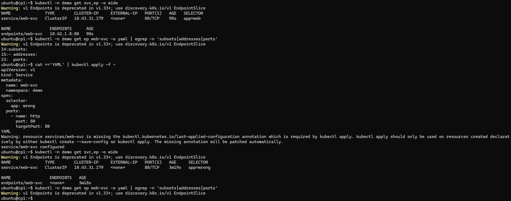

# Ingress와 Traefik의 차이 (Kubernetes 관점)

> 한 줄 요약: **Ingress는 “규칙(리소스)”, Traefik은 그 규칙을 실제로 적용해 트래픽을 라우팅하는 “컨트롤러/프록시(구현체)”** 입니다.

---

## 1) Ingress란?

**Ingress**는 Kubernetes의 **리소스(Resource) 오브젝트**로, 클러스터 외부(또는 다른 네트워크)에서 들어오는 HTTP/HTTPS 트래픽을 **어떤 Service로, 어떤 규칙으로** 보낼지 정의합니다.

- 무엇을 정의하나?
  - 호스트 기반 라우팅: `example.com` → `service-a`
  - 경로 기반 라우팅: `/api` → `service-api`, `/web` → `service-web`
  - TLS(HTTPS) 종료: 인증서(secret) 연결
- 무엇을 “하지” 않나?
  - Ingress 자체는 트래픽을 실제로 프록시하지 않습니다.
  - **실제 동작은 Ingress Controller**가 합니다.

즉, Ingress는 “정책/규칙” 문서(선언)이고, 실제로 그걸 실행하는 엔진이 필요합니다.

---

## 2) Traefik이란?

**Traefik**은 (주로) Kubernetes에서 쓰이는 **Ingress Controller(컨트롤러)** 이자 **리버스 프록시/로드밸런서** 입니다.

- Kubernetes API를 감시(watch)하면서
  - `Ingress` / `Service` / `Endpoint` / (선택) `IngressRoute` 같은 리소스를 읽고
- 그 정보를 바탕으로
  - 실제 프록시 라우팅 설정을 동적으로 구성하고
  - 외부 트래픽을 내부 서비스로 전달합니다.

즉, Traefik은 “Ingress 규칙을 실제로 실행하는 구현체”에 해당합니다.

---

## 3) 핵심 차이: 개념 vs 구현

| 구분 | Ingress | Traefik |
|---|---|---|
| 정체 | Kubernetes **리소스(규격/객체)** | Ingress Controller **소프트웨어(프록시)** |
| 역할 | “이 호스트/경로는 이 Service로”라는 **라우팅 규칙 선언** | 그 규칙을 읽고 **실제로 트래픽을 라우팅** |
| 동작 주체 | 혼자선 동작 X (컨트롤러 필요) | 스스로 동작 (컨트롤러/프록시) |
| 범위 | 표준(일반적인 기능 위주) | 제품/프로젝트별 기능 확장 가능 |
| 예 | `kind: Ingress` YAML | Traefik 배포(Deployment/DaemonSet) + 설정/CRD |

**정리:**  
- Ingress = “표준 API 리소스(규칙 문서)”
- Traefik = “그 규칙을 적용하는 컨트롤러/프록시”

---

## 4) Ingress Controller란?

Ingress가 실제로 작동하려면 **Ingress Controller**가 있어야 합니다.

대표적인 Ingress Controller:
- **Traefik**
- NGINX Ingress Controller
- HAProxy Ingress
- Istio/Envoy 기반 Gateway 등(엄밀히는 Ingress 대체/확장)

컨트롤러는 `Ingress` 리소스를 감시하고, 라우팅 설정을 갱신하며, 요청을 프록시합니다.

---

## 5) Traefik이 Ingress “말고도” 하는 것들

Traefik은 Ingress를 지원하는 것 외에도 다양한 기능을 제공합니다(설치/설정에 따라 다름).

- 대시보드(라우팅/서비스 상태 확인)
- 미들웨어(Middleware)
  - 리다이렉트(HTTP→HTTPS)
  - 경로 재작성(Rewrite)
  - BasicAuth / IP allowlist
  - Rate limit 등
- Let’s Encrypt(ACME)로 TLS 자동 발급/갱신(구성 시)
- Kubernetes CRD 기반 확장 리소스 지원
  - `IngressRoute`, `Middleware`, `TLSOption`, `TraefikService` 등

> 표준 Ingress로 표현하기 어려운 세밀한 제어를 Traefik CRD로 제공하는 경우가 많습니다.

---

## 6) 예시: 표준 Ingress로 Traefik에 라우팅 규칙 적용

아래는 **표준 Ingress** YAML입니다.  
Traefik이 Ingress Controller로 동작 중이면, 이 규칙을 읽고 라우팅을 구성합니다.

```yaml
apiVersion: networking.k8s.io/v1
kind: Ingress
metadata:
  name: web-ing
  namespace: default
  annotations:
    kubernetes.io/ingress.class: traefik  # (환경에 따라) traefik이 이 Ingress를 처리하도록 지정
spec:
  rules:
  - host: demo.example.com
    http:
      paths:
      - path: /
        pathType: Prefix
        backend:
          service:
            name: web-svc
            port:
              number: 80
```

- 위 YAML은 “규칙”이고,
- Traefik은 이를 읽어 실제 트래픽을 `web-svc:80`으로 전달합니다.

---

## 7) 예시: Traefik CRD(IngressRoute)로 더 세밀하게

Traefik을 CRD 모드로 쓰면, 아래처럼 **IngressRoute** 리소스를 사용하기도 합니다.

```yaml
apiVersion: traefik.io/v1alpha1
kind: IngressRoute
metadata:
  name: web-route
  namespace: default
spec:
  entryPoints:
    - web
  routes:
    - match: Host(`demo.example.com`) && PathPrefix(`/`)
      kind: Rule
      services:
        - name: web-svc
          port: 80
```

- 표준 Ingress보다 Traefik 고유 기능을 쓰기 쉬운 장점이 있습니다.
- 다만 “표준성”은 낮아져서, 컨트롤러 교체 시 마이그레이션 비용이 늘 수 있습니다.

---

## 8) 언제 Ingress(표준)만 쓰고, 언제 Traefik CRD를 쓰나?

**표준 Ingress 위주(권장 시작점)**
- 단순 호스트/경로 라우팅 + TLS 정도면 충분
- 다른 컨트롤러로 바꿀 가능성이 있음(이식성 중요)
- 팀 표준을 Kubernetes 표준 리소스로 유지하고 싶음

**Traefik CRD까지 활용**
- 미들웨어/인증/리라이트/세밀한 라우팅 정책이 많이 필요
- Traefik 고유 기능(대시보드/동적 설정/옵션)을 적극 활용
- 컨트롤러를 Traefik으로 고정해도 괜찮음

---

## 9) k3s 환경에서 자주 보는 포인트 (실습/교육용)

k3s는 배포 옵션에 따라 **기본 Ingress Controller가 Traefik인 경우가 많습니다.**  
따라서 “Ingress를 만들었는데 잘 된다”면, 뒤에서 Traefik이 동작 중일 확률이 높습니다.

확인 예시:
```bash
kubectl -n kube-system get pods | grep -i traefik
kubectl get ingress -A
kubectl describe ingress -A
```

---

## 10) 자주 헷갈리는 질문 정리

### Q1. “Ingress가 있으면 Traefik은 없어도 되나요?”
아니요. **Ingress는 규칙일 뿐이라**, 반드시 이를 처리하는 **Ingress Controller(예: Traefik, NGINX 등)** 가 필요합니다.

### Q2. “Traefik을 쓰면 Ingress를 안 써도 되나요?”
가능은 합니다. Traefik CRD(`IngressRoute`)를 쓰면 표준 Ingress 없이도 라우팅을 정의할 수 있습니다.  
다만 표준성과 이식성을 생각하면 **Ingress부터 시작**하는 경우가 많습니다.

### Q3. “Ingress vs LoadBalancer vs NodePort 관계는?”
- **Ingress**: L7(HTTP/HTTPS) 라우팅 규칙
- **Service NodePort/LoadBalancer**: L4 수준에서 외부 접근 경로 제공(포트/로드밸런서)
- 실제 현장에선 보통:
  - 외부 → (LoadBalancer/NodePort) → Ingress Controller(Traefik) → Service → Pod

---

## 11) 체크리스트(문제 발생 시)

- Ingress Controller가 떠 있나?
  - `kubectl -n kube-system get pods | grep -i traefik`
- IngressClass / annotation 지정이 맞나?
  - 환경에 따라 `ingressClassName` 또는 annotation 필요
- Service/Port가 맞나?
  - backend service name, port number 확인
- DNS/Host가 맞나?
  - `Host` 기반이면 실제 요청 Host 헤더가 일치해야 함
- TLS secret/인증서가 맞나?
  - `kubectl get secret -n <ns>`

---

## 결론

- **Ingress**: Kubernetes 표준 리소스로 “라우팅 규칙”을 선언한다.
- **Traefik**: 그 규칙을 읽어 실제로 트래픽을 프록시하는 “Ingress Controller/리버스 프록시”다.

둘은 경쟁 관계가 아니라, 보통은 **Ingress(규칙)** + **Traefik(실행 엔진)** 처럼 함께 사용됩니다.

---


> 대상: k3s 클러스터(기본 Traefik), 교육/실습용  
> 목표: **일부러 문제를 만들고 → 진단 → 해결**까지 “손에 익는” 흐름으로 반복

---

## 0) 실습 공통 준비

### 0-1. 네임스페이스 생성
```sh
kubectl create ns demo
```
(이미 있으면 에러 나도 무시 OK)

### 0-2. 기본 앱 배포(nginx) + 서비스
```sh
kubectl -n demo create deploy web --image=nginx:1.27-alpine
kubectl -n demo expose deploy web --port=80 --target-port=80 --name=web-svc
kubectl -n demo get deploy,pod,svc -o wide
```
---
```
ubuntu@cp1:~$ kubectl create ns demo
namespace/demo created
ubuntu@cp1:~$ kubectl -n demo create deploy web --image=nginx:1.27-alpine
deployment.apps/web created
ubuntu@cp1:~$ kubectl -n demo expose deploy web --port=80 --target-port=80 --name=web-svc
service/web-svc exposed
ubuntu@cp1:~$ kubectl -n demo get deploy,pod,svc -o wide
NAME                  READY   UP-TO-DATE   AVAILABLE   AGE   CONTAINERS   IMAGES              SELECTOR
deployment.apps/web   1/1     1            1           23s   nginx        nginx:1.27-alpine   app=web

NAME                       READY   STATUS    RESTARTS   AGE   IP          NODE   NOMINATED NODE   READINESS GATES
pod/web-79ffc79c64-wgc5c   1/1     Running   0          23s   10.42.1.8   w1     <none>           <none>

NAME              TYPE        CLUSTER-IP     EXTERNAL-IP   PORT(S)   AGE   SELECTOR
service/web-svc   ClusterIP   10.43.31.179   <none>        80/TCP    11s   app=web
ubuntu@cp1:~$
```
---

### 0-3. 편의 변수(선택)
```sh
NS=demo
APP=web
SVC=web-svc
```
---
```
ubuntu@cp1:~$ NS=demo
ubuntu@cp1:~$ echo $NS
demo
```

---

## 1) LAB-01: Service 라우팅 장애(Endpoints 비어있음) 만들기 & 해결하기
> 핵심 학습: **Service selector ↔ Pod label 불일치** → Endpoints 없음 → 접속 실패

### 1-A. 정상 상태 확인(Endpoints가 존재해야 함)
```sh
kubectl -n demo get svc,ep -o wide
```
---
ubuntu@cp1:~$ kubectl -n demo get svc,ep -o wide
Warning: v1 Endpoints is deprecated in v1.33+; use discovery.k8s.io/v1 EndpointSlice
NAME              TYPE        CLUSTER-IP     EXTERNAL-IP   PORT(S)   AGE   SELECTOR
service/web-svc   ClusterIP   10.43.31.179   <none>        80/TCP    98s   app=web

NAME                ENDPOINTS      AGE
endpoints/web-svc   10.42.1.8:80   98s

---

```
kubectl -n demo get ep web-svc -o yaml | egrep -n 'subsets|addresses|ports'
```
---
```
ubuntu@cp1:~$ kubectl -n demo get ep web-svc -o yaml | egrep -n 'subsets|addresses|ports'
Warning: v1 Endpoints is deprecated in v1.33+; use discovery.k8s.io/v1 EndpointSlice
14:subsets:
15:- addresses:
23:  ports:
```

### 1-B. 장애 만들기: Service selector를 일부러 틀리게 바꾸기
아래 YAML로 **selector를 app=wrong**으로 변경합니다.

```sh
cat <<'YAML' | kubectl apply -f -
apiVersion: v1
kind: Service
metadata:
  name: web-svc
  namespace: demo
spec:
  selector:
    app: wrong
  ports:
    - name: http
      port: 80
      targetPort: 80
YAML
```
---
```
service/web-svc configured
```
---

### 1-C. 증상 확인
```sh
kubectl -n demo get svc,ep -o wide
kubectl -n demo get ep web-svc -o yaml | egrep -n 'subsets|addresses|ports'
```


- 기대 결과: **Endpoints가 비어 있음**

클러스터 내부에서 curl 테스트(실패해야 정상)

```sh
kubectl run -n demo tmp --rm -it --image=curlimages/curl -- sh -lc "curl -sv http://web-svc:80/ 2>&1 | head -n 40"
```
---
```
ubuntu@cp1:~$ kubectl run -n demo tmp --rm -it --image=curlimages/curl -- sh -lc "curl -sv http://web-svc:80/ 2>&1 | head -n 40"
Error from server (AlreadyExists): pods "tmp" already exists
```
---
```
ubuntu@cp1:~$ kubectl run -n demo tmp --rm -it --image=curlimages/curl -- sh -lc "curl -sS http://web-svc:80/ | head"
Error from server (AlreadyExists): pods "tmp" already exists

ubuntu@cp1:~$ kubectl -n demo delete pod tmp --force --grace-period=0
Warning: Immediate deletion does not wait for confirmation that the running resource has been terminated. The resource may continue to run on the cluster indefinitely.
pod "tmp" force deleted from demo namespace
ubuntu@cp1:~$ kubectl -n demo get pod tmp
Error from server (NotFound): pods "tmp" not found
```

### 위의 과정 다시
```
ubuntu@cp1:~$ cat <<'YAML' | kubectl apply -f -
apiVersion: v1
kind: Service
metadata:
  name: web-svc
  namespace: demo
spec:
  selector:
    app: wrong
  ports:
    - name: http
      port: 80
      targetPort: 80
YAML
service/web-svc configured
ubuntu@cp1:~$ kubectl -n demo get ep web-svc -o wide
Warning: v1 Endpoints is deprecated in v1.33+; use discovery.k8s.io/v1 EndpointSlice
NAME      ENDPOINTS   AGE
web-svc   <none>      12m
```
---


### 1-D. 원인 진단(정답 루트)
```sh
kubectl -n demo get svc web-svc -o jsonpath='{.spec.selector}'; echo
```
---

```sh
ubuntu@cp1:~$ kubectl -n demo get svc web-svc -o jsonpath='{.spec.selector}'; echo
{"app":"wrong"}
```
---

```sh
kubectl -n demo get pod --show-labels
```
---

```sh
ubuntu@cp1:~$ kubectl -n demo get pod --show-labels
NAME                   READY   STATUS             RESTARTS      AGE     LABELS
tmp                    0/1     CrashLoopBackOff   3 (49s ago)   106s    run=tmp
web-79ffc79c64-wgc5c   1/1     Running            0             6m17s   app=web,pod-template-hash=79ffc79c64
```
---
### 1-E. 해결: Service selector를 원래대로(app=web) 복구
```sh
cat <<'YAML' | kubectl apply -f -
apiVersion: v1
kind: Service
metadata:
  name: web-svc
  namespace: demo
spec:
  selector:
    app: web
  ports:
    - name: http
      port: 80
      targetPort: 80
YAML
```

### 1-F. 해결 검증
```sh
kubectl -n demo get ep web-svc -o wide
kubectl run -n demo tmp --rm -it --image=curlimages/curl -- sh -lc "curl -sS http://web-svc:80/ | head"
```
---
```
ubuntu@cp1:~$ kubectl -n demo get ep web-svc -o wide
Warning: v1 Endpoints is deprecated in v1.33+; use discovery.k8s.io/v1 EndpointSlice
NAME      ENDPOINTS   AGE
web-svc   <none>      12m
ubuntu@cp1:~$ cat <<'YAML' | kubectl apply -f -
apiVersion: v1
kind: Service
metadata:
  name: web-svc
  namespace: demo
spec:
  selector:
    app: web
  ports:
    - name: http
      port: 80
      targetPort: 80
YAML
service/web-svc configured
ubuntu@cp1:~$ kubectl -n demo get ep web-svc -o wide
Warning: v1 Endpoints is deprecated in v1.33+; use discovery.k8s.io/v1 EndpointSlice
NAME      ENDPOINTS      AGE
web-svc   10.42.1.8:80   14m
```

---

## 2) LAB-02: Pod CrashLoopBackOff 만들기 & 해결하기
> 핵심 학습: **describe 이벤트 → logs/previous → exec로 내부 확인**

---
