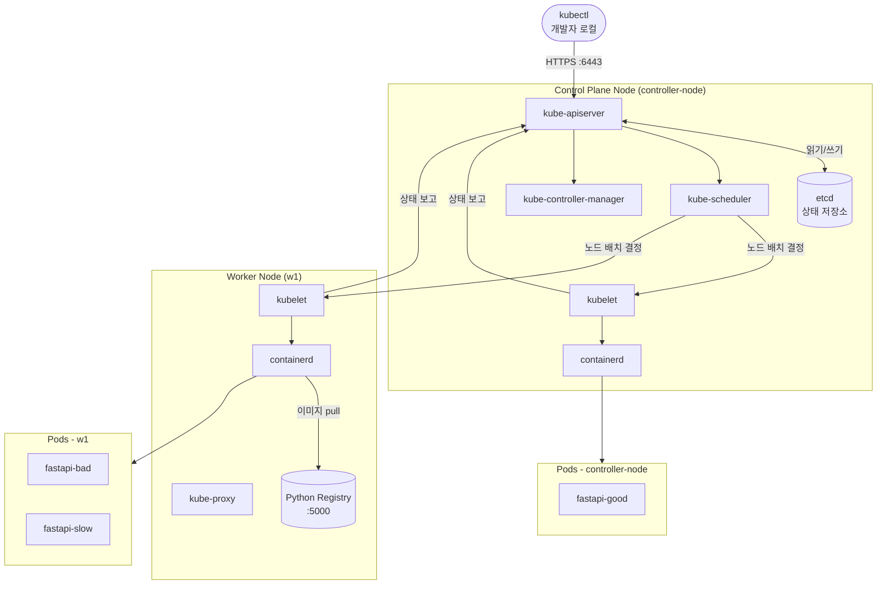
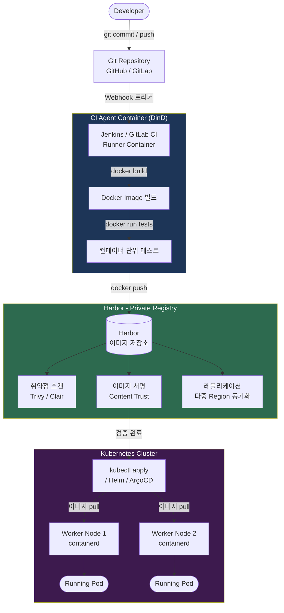
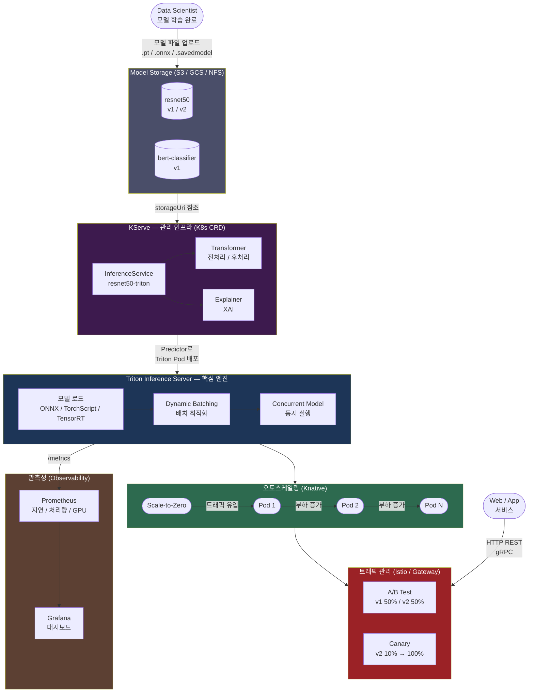

# Kubernetes-Class-Master


---

## VMware 다운로드 및 설치 (권장)

[](https://support.broadcom.com/group/ecx/productdownloads?subfamily=VMware+Workstation+Pro)
[](https://support.broadcom.com/group/ecx/productdownloads?subfamily=VMware+Fusion)

> **공식 다운로드 (Broadcom 계정 필요)**
> - Workstation Pro (Windows/Linux): https://support.broadcom.com/group/ecx/productdownloads?subfamily=VMware+Workstation+Pro
> - Fusion Pro (macOS): https://support.broadcom.com/group/ecx/productdownloads?subfamily=VMware+Fusion

> **참고**: VMware Workstation Pro / Fusion Pro 는 2024년부터 개인 사용자에게 **무료** 제공됩니다.

```
[설치 단계 요약]

① Broadcom 계정 생성 또는 로그인 (https://profile.broadcom.com/web/registration)
       ↓
② 제품 페이지에서 최신 버전 설치 파일 다운로드
       ↓
③ Windows: .exe 실행 → 설치 마법사 진행 (Enhanced Keyboard Driver 포함 권장)
   macOS:  .dmg 열기 → Applications 이동 → 시스템 보안 승인
   Linux:  chmod +x *.bundle && sudo ./VMware-Workstation-Full-*.bundle
       ↓
④ 첫 실행 시 "Use for free" (개인 무료 라이선스) 선택
       ↓
⑤ 설치 확인: vmrun list
```

→ VMware 상세 K8s 설정: **[`vmware/README.md`](./vmware/README.md)**

---

## VirtualBox 다운로드 및 설치 (대안)

[](https://www.virtualbox.org/wiki/Downloads)

> **공식 다운로드**: https://www.virtualbox.org/wiki/Downloads

```
[설치 단계 요약]

① OS 에 맞는 패키지 다운로드 (Windows .exe / macOS .dmg / Linux .deb/.rpm)
       ↓
② 설치 마법사 실행 (관리자/sudo 권한 필요)
       ↓
③ Extension Pack 설치 (USB 3.0, RDP 지원용)
   → 같은 페이지의 "VirtualBox Extension Pack" 다운로드 후 설치
       ↓
④ 설치 확인: VBoxManage --version
```

| OS | 직접 다운로드 |
|----|--------------|
| Windows 10/11 | https://download.virtualbox.org/virtualbox/7.1.4/VirtualBox-7.1.4-165100-Win.exe |
| macOS Intel | https://download.virtualbox.org/virtualbox/7.1.4/VirtualBox-7.1.4-165100-OSX.dmg |
| macOS Apple Silicon | https://download.virtualbox.org/virtualbox/7.1.4/VirtualBox-7.1.4-165100-macOSArm64.dmg |
| Ubuntu 24.04 | https://download.virtualbox.org/virtualbox/7.1.4/virtualbox-7.1_7.1.4-165100~Ubuntu~noble_amd64.deb |

→ VirtualBox 상세 K8s 설정: **[`virtualbox/README.md`](./virtualbox/README.md)**

---

## GitHub Codespaces 실습 (대안, 4 CPU / 16 GB)

이 저장소는 GitHub Codespaces 에서 **4 CPU / 16 GB** 머신으로  
Kubernetes Control Plane 단일 노드를 자동 구성합니다.

```
[Codespaces 시작 방법]

① GitHub 저장소 페이지 → "Code" 버튼 클릭
       ↓
② "Codespaces" 탭 → "..." 메뉴 → "New with options..."
       ↓
③ Machine type: "4-core" (4 CPU / 16 GB RAM) 선택
       ↓
④ "Create codespace" 클릭
       ↓
⑤ 컨테이너 빌드 완료 후 자동으로 k8s 단일 노드 클러스터 생성
       ↓
⑥ 아래 명령어로 클러스터 확인
```

```bash
# Codespaces 터미널에서 실행
kubectl config current-context   # kind-lecture
kubectl get nodes                 # control-plane Ready
kubectl get ns lecture            # lecture 네임스페이스
```

### Codespaces 자동 구성 내용

| 항목 | 값 |
|------|----|
| 머신 타입 | 4 CPU / 16 GB RAM |
| Kubernetes 배포 방식 | kind (Docker-in-Docker) |
| 클러스터 구성 | Control Plane 단일 노드 |
| 설치 도구 | kubectl, helm, kind |
| 기본 네임스페이스 | `lecture` |

---

## 학습 동선
- 번호 순서대로 폴더를 진행합니다: `00-Docker-Images` → `14-Reference-Cheatsheets`
- 각 폴더의 `README.md`에 강의 목표·이론·실습 명령어가 통합되어 있습니다
- `kube-manifests/` 하위 폴더에 YAML 실습 파일이 포함되어 있습니다

```mermaid
flowchart LR
    A([00\nDocker Images]) --> B([01\nK8s Architecture])
    B --> C([02\nPods\nkubectl])
    C --> D([03\nReplicaSets\nkubectl])
    D --> E([04\nDeployments\nkubectl])
    E --> F([05\nServices\nkubectl])
    F --> G([06\nYAML Basics])

    G --> H([07\nPods YAML])
    H --> I([08\nReplicaSets\nYAML])
    I --> J([09\nDeployments\nYAML])
    J --> K([10\nServices\nYAML])

    K --> L([11\nDashboard\nObservability])
    L --> M([12\nHPA\nAutoScaling])
    M --> N([13\nNetwork\nIngress])
    N --> O([14\nCheatsheets])

    style A fill:#2d6a4f,color:#fff
    style G fill:#1d3557,color:#fff
    style O fill:#9b2226,color:#fff
```



## 강의 구성

| 폴더 | 주제 |
|------|------|
| [`00-Docker-Images/`](./00-Docker-Images/) | 환경 구축과 Docker 이미지 준비 |
| [`01-Kubernetes-Architecture/`](./01-Kubernetes-Architecture/) | Kubernetes Architecture |
| [`02-PODs-with-kubectl/`](./02-PODs-with-kubectl/) | Pods with kubectl |
| [`03-ReplicaSets-with-kubectl/`](./03-ReplicaSets-with-kubectl/) | ReplicaSets with kubectl |
| [`04-Deployments-with-kubectl/`](./04-Deployments-with-kubectl/) | Deployments with kubectl |
| [`05-Services-with-kubectl/`](./05-Services-with-kubectl/) | Services with kubectl |
| [`06-YAML-Basics/`](./06-YAML-Basics/) | YAML Basics |
| [`07-PODs-with-YAML/`](./07-PODs-with-YAML/) | Pods with YAML |
| [`08-ReplicaSets-with-YAML/`](./08-ReplicaSets-with-YAML/) | ReplicaSets with YAML |
| [`09-Deployments-with-YAML/`](./09-Deployments-with-YAML/) | Deployments with YAML |
| [`10-Services-with-YAML/`](./10-Services-with-YAML/) | Services with YAML |
| [`11-Dashboard-Observability/`](./11-Dashboard-Observability/) | Dashboard와 Observability |
| [`12-HPA-AutoScaling/`](./12-HPA-AutoScaling/) | Auto Scaling (HPA) |
| [`13-Network-Ingress-Troubleshooting/`](./13-Network-Ingress-Troubleshooting/) | Network, Ingress, Troubleshooting |
| [`14-Reference-Cheatsheets/`](./14-Reference-Cheatsheets/) | Reference & Cheatsheets |

## 핵심 개념 요약

### Kubernetes의 어원
- Kubernetes는 고대 그리스어 `kubernētēs`(조타수/항해사)에서 유래
- `k8s`는 `K`와 `s` 사이 8글자를 줄인 표기

### VM (Virtual Machine)
- 하드웨어 가상화 기반으로 OS 단위 격리
- 장점: 격리/호환성 높음
- 단점: 자원 오버헤드 큼

### Container
- OS 커널 공유 + 프로세스 단위 격리
- 장점: 가볍고 빠른 배포
- 단점: 커널 공유로 보안/격리 설계 중요

### Docker
- 컨테이너 이미지 빌드/배포/실행 도구 생태계
- Dockerfile, 레지스트리, 실행/네트워크/볼륨 관리 제공

### OCI (Open Container Initiative)
- 컨테이너 이미지/런타임 표준
- 목적: 도구/런타임 간 호환성 확보

### Kubernetes (k8s)
- 컨테이너 오케스트레이션 플랫폼
- 배포/스케일링/복구/롤링업데이트/서비스 라우팅 자동화

## 비교 표

| 구분 | VM | Container | Docker | OCI | Kubernetes |
|---|---|---|---|---|---|
| 성격 | 하드웨어 가상화 | OS 수준 격리 | 컨테이너 도구 생태계 | 컨테이너 표준 | 오케스트레이션 플랫폼 |
| 격리 | 높음(OS 단위) | 중간(프로세스 단위) | 컨테이너 격리 기반 | 표준 자체는 실행 주체 아님 | Pod/Namespace 기반 |
| 자원 효율 | 낮음 | 높음 | 높음 | N/A | 높음 |
| 주요 목적 | 레거시/강격리 | 경량 앱 실행 | 빌드/배포 편의 | 호환성 | 대규모 운영 자동화 |

## Kubernetes 클러스터 아키텍처



## Kubelet 정리
- kubelet은 각 노드의 에이전트로서 Pod를 실제 실행/유지
- API Server와 통신해 노드/Pod 상태 보고
- Liveness/Readiness/Startup probe 결과 반영
- metrics-server가 kubelet로부터 리소스 지표 수집

### 확인 명령
```bash
# kubeadm 계열 클러스터
sudo systemctl status kubelet
sudo journalctl -u kubelet -n 200 --no-pager

# k3s 계열 클러스터
sudo systemctl status k3s
sudo systemctl status k3s-agent
```

## 오케스트레이션 핵심 기능
- 배포(Deployment)
- 스케일링(HPA)
- 자동 복구(Self-Healing)
- 네트워킹(Service/Ingress)
- 구성 관리(ConfigMap/Secret)
- 롤링 업데이트 및 롤백

## CSP 관리형 서비스 예시

| CSP | 관리형 Kubernetes | 이미지 레지스트리 | 서버리스/관리형 컨테이너 |
|---|---|---|---|
| AWS | EKS | ECR | Fargate |
| GCP | GKE | Artifact Registry | Cloud Run |
| Azure | AKS | ACR | ACI |
| Oracle Cloud | OKE | OCIR | Virtual Nodes |

## GitHub Codespaces 실습
1. GitHub에서 이 저장소를 Codespaces로 엽니다 (4 CPU / 16 GB 머신 선택).
2. 컨테이너 생성 후 `postCreateCommand`가 실행되어 `kubectl`, `helm`, `kind`를 설치합니다.
3. kind Control Plane 단일 노드 클러스터(`kind-lecture`)가 없으면 자동 생성됩니다.
4. 클러스터 확인:
```bash
kubectl config current-context
kubectl get nodes
kubectl get ns lecture
```

## 활용 방법
1. `00-Docker-Images`부터 `14-Reference-Cheatsheets` 순서로 진행합니다.
2. 각 폴더의 `README.md`에서 강의 목표와 권장 순서를 먼저 확인합니다.
3. 실습 중 막히면 `13-Network-Ingress-Troubleshooting`의 트러블슈팅 섹션을 참고합니다.
4. 최종 복습은 `14-Reference-Cheatsheets`의 치트시트/용어집/샌드박스로 마무리합니다.


---


# Harbor와 DinD(Docker-in-Docker) 개념 정리

개발 및 데브옵스(DevOps) 환경에서 자주 사용되는 **Harbor(하버)**와 **DinD(도커 인 도커)**에 대한 핵심 정리 문서입니다. 두 기술은 컨테이너 생태계에서 서로 다른 목적과 역할을 가지고 있습니다.

---

## 1. Harbor (하버) 개요
> **"우리 팀만 사용하는 안전하고 프라이빗한 컨테이너 이미지 저장소(Registry)"**

개발이 완료된 애플리케이션은 도커 이미지 형태로 빌드됩니다. 이 이미지를 저장하고 필요할 때 다운로드(Pull)받는 공간이 필요한데, 가장 대중적인 공용 서비스가 '도커 허브(Docker Hub)'입니다. 

하지만 기업에서는 보안상 소스코드나 내부 설정이 포함된 이미지를 공용 저장소에 올릴 수 없습니다. 이때 사내 인프라(On-Premise)나 독립된 클라우드 환경에 직접 구축하여 사용하는 오픈소스 사설 저장소가 바로 **Harbor**입니다.

### 주요 기능 및 특징
* **보안 및 권한 관리 (RBAC):** 사용자 및 팀별로 이미지 접근, 업로드(Push), 다운로드(Pull) 권한을 세부적으로 통제합니다.
* **취약점 스캔 (Vulnerability Scanning):** Trivy, Clair 등과 연동하여 업로드된 이미지 내부의 보안 취약점이나 악성코드를 자동으로 검사합니다.
* **이미지 서명 (Content Trust):** 신뢰할 수 있는 작성자가 배포한 이미지인지 검증하여 컨테이너 위변조를 방지합니다.
* **동기화 및 복제 (Replication):** 여러 지역(Region)에 위치한 Harbor 서버 간에 이미지를 자동으로 동기화하여 고가용성을 확보합니다.

---

## 2. DinD (Docker-in-Docker) 개요
> **"도커 컨테이너 내부에서 또 다른 도커 컨테이너를 실행하는 기술"**

일반적으로 도커는 호스트 OS(서버 또는 PC) 위에서 실행됩니다. 하지만 **"도커가 실행 중인 컨테이너 안에서 다시 `docker run`이나 `docker build`를 실행하면 어떻게 될까?"**라는 아이디어에서 나온 아키텍처가 DinD입니다. 컨테이너 내부에 독립적인 도커 데몬(Docker Daemon)을 통째로 구동하는 방식입니다.

### 주요 유스케이스
* **CI/CD 파이프라인 (Jenkins, GitLab CI 등):** 소스코드를 빌드하여 새로운 도커 이미지로 만들고 테스트해야 할 때, 빌드를 수행하는 에이전트 자체가 컨테이너 기반으로 돌고 있다면 DinD 구조가 활용됩니다.
* **도커 자체의 개발 및 테스트:** 도커 시스템이나 테스트 환경을 격리된 상태로 유지하며 실험해야 할 때 사용합니다.

### 주의점 및 한계
* **보안 취약성:** 컨테이너 내부에 완벽한 가상화 도커 환경을 만들기 위해 호스트의 권한(`--privileged` 옵션)을 과도하게 부여해야 하므로 보안상 위험할 수 있습니다.
* **대안 (DooD):** 최근에는 보안과 효율성을 위해 호스트의 도커 소켓(`/var/run/docker.sock`)을 컨테이너와 공유하여 사용하는 **DooD (Docker-out-of-Docker)** 방식을 더 권장하기도 합니다.

---

## 3. Harbor vs DinD 한눈에 비교

| 구분 | Harbor (하버) | DinD (Docker-in-Docker) |
| :--- | :--- | :--- |
| **역할** | 컨테이너 이미지 **저장 및 관리** | 컨테이너 내부에서 **또 다른 컨테이너 실행** |
| **성격** | 소프트웨어 제품 (컨테이너 레지스트리) | 아키텍처 / 기술적 접근 방식 |
| **비유** | 제품(이미지)을 안전하게 보관하는 **보안 창고** | 인형 안에 인형이 들어있는 **러시아 마트료시카 인형** |
| **주요 사용 시점** | 빌드된 이미지를 안전하게 보관하고 배포할 때 | CI/CD 파이프라인 안에서 이미지를 생성·테스트할 때 |

---

## 4. 실무에서의 연관 관계 (Workflow)

실제 데브옵스 환경에서는 두 기술이 다음과 같은 흐름으로 함께 연결되어 사용됩니다.



---

# Model Serving · Triton · KServe 개념 정리

AI 모델 개발 이후 실제 서비스(웹, 앱 등)에 배포하고 운영하기 위한 **Model Serving(모델 서빙)** 생태계의 핵심 개념 및 도구 정리입니다.

> **한 줄 관계 요약**: 개념(Serving) ➡️ 핵심 엔진(Triton) ➡️ 이를 아우르는 거대한 관리 인프라(KServe)

---

## 1. Model Serving (모델 서빙) — 개념

> **"학습이 끝난 AI 모델을 외부 요청에 응답할 수 있도록 API 형태로 지속 실행하는 것"**

머신러닝 모델은 학습(Training)이 끝나면 `.pt`, `.onnx`, `.savedmodel` 등의 파일로 저장됩니다.  
이 파일 자체는 그냥 숫자 덩어리일 뿐이며, 실제 앱에서 사용하려면 **HTTP/gRPC 엔드포인트로 요청을 받고 추론(Inference) 결과를 반환하는 서버**가 필요합니다. 이 역할 전체를 **Model Serving**이라고 부릅니다.

### 모델 서빙이 단순 API 서버와 다른 이유

| 일반 API 서버 | 모델 서빙 서버 |
| :--- | :--- |
| CPU 연산 위주 | GPU/NPU 가속 필수 |
| 요청당 독립 처리 | 배치(Batch) 처리로 GPU 활용률 극대화 |
| 코드 배포 단위 | 모델 파일(Artifact) 버전 단위 배포 |
| 단순 스케일아웃 | GPU 할당·공유·메모리 관리 필요 |
| 단일 포맷 | 프레임워크별 모델 포맷 혼재 (PyTorch, TF, ONNX…) |

### 서빙의 핵심 과제

* **지연(Latency)**: 사용자 요청에 ms 단위로 응답해야 함
* **처리량(Throughput)**: 동시 다중 요청을 GPU 낭비 없이 처리
* **모델 버전 관리**: A/B 테스트, 카나리 배포, 롤백
* **멀티 프레임워크**: PyTorch·TensorFlow·ONNX·TensorRT를 단일 서버에서 지원
* **관측성(Observability)**: 추론 지연·GPU 사용률·오류율 모니터링

---

## 2. Triton Inference Server — 핵심 엔진

> **"NVIDIA가 만든 고성능 오픈소스 추론(Inference) 서버 엔진"**

Triton은 모델 서빙의 핵심 실행 엔진입니다. 여러 딥러닝 프레임워크의 모델을 단일 서버에서 동시에 서빙하고, GPU 자원을 최대한 활용하도록 설계된 NVIDIA의 오픈소스 프로젝트입니다.

### 주요 기능

* **멀티 프레임워크 지원**: PyTorch(TorchScript), TensorFlow SavedModel, ONNX, TensorRT, OpenVINO, Python 커스텀 백엔드 등
* **동적 배칭(Dynamic Batching)**: 지연 허용 범위 내에서 여러 요청을 묶어 GPU 활용률을 높임
* **모델 앙상블(Model Ensemble)**: 전처리→추론→후처리 파이프라인을 단일 요청으로 묶음
* **동시 모델 실행(Concurrent Execution)**: 하나의 GPU에서 여러 모델 인스턴스를 병렬 실행
* **프로토콜**: HTTP REST / gRPC 동시 지원 (KServe v2 Inference Protocol 준수)
* **모델 레포지토리**: 로컬 파일시스템, S3, GCS, Azure Blob 등 다양한 스토리지에서 모델 로드

### Triton 모델 레포지토리 구조

```
model_repository/
├── resnet50/              # 모델 이름
│   ├── config.pbtxt       # 입력/출력 텐서, 배칭 설정
│   ├── 1/                 # 버전 1
│   │   └── model.onnx
│   └── 2/                 # 버전 2
│       └── model.onnx
└── bert_classifier/
    ├── config.pbtxt
    └── 1/
        └── model.pt
```

### Triton 배포 예시 (Docker)

```bash
# NVIDIA GPU가 있는 환경에서 Triton 서버 실행
docker run --gpus all --rm \
  -p 8000:8000 \   # HTTP
  -p 8001:8001 \   # gRPC
  -p 8002:8002 \   # Metrics (Prometheus)
  -v $(pwd)/model_repository:/models \
  nvcr.io/nvidia/tritonserver:24.01-py3 \
  tritonserver --model-repository=/models

# 추론 요청
curl -X POST http://localhost:8000/v2/models/resnet50/infer \
  -H "Content-Type: application/json" \
  -d '{"inputs": [{"name": "input", "shape": [1,3,224,224], "datatype": "FP32", "data": [...]}]}'
```

---

## 3. KServe — 관리 인프라

> **"Kubernetes 위에서 모델 서빙 전체 라이프사이클을 자동화하는 MLOps 플랫폼"**

KServe(구 KFServing)는 Kubernetes의 CRD(Custom Resource Definition)를 활용해 **모델 배포·버전 관리·오토스케일링·트래픽 분할·모니터링**을 선언형으로 관리합니다. 내부적으로 Triton, TorchServe, TFServing 등 다양한 서빙 엔진을 추상화하여 사용합니다.

### 핵심 구성요소

| 컴포넌트 | 역할 |
| :--- | :--- |
| **InferenceService** | 모델 서빙의 핵심 CRD — 모델 경로·서빙 엔진·스케일링 정책 선언 |
| **Predictor** | 실제 추론을 수행하는 컨테이너 (Triton, TorchServe, TFServing 등) |
| **Transformer** | 추론 전/후 전처리·후처리 담당 사이드카 |
| **Explainer** | 모델 예측 결과에 대한 설명 가능성(XAI) 제공 |
| **Knative Serving** | 요청 기반 오토스케일링 (0→N, Scale-to-Zero 포함) |
| **Istio / Gateway** | 트래픽 라우팅·카나리 배포·A/B 테스트 |

### InferenceService YAML 예시 (Triton 백엔드)

```yaml
apiVersion: serving.kserve.io/v1beta1
kind: InferenceService
metadata:
  name: resnet50-triton
  namespace: mlserving
spec:
  predictor:
    triton:
      storageUri: s3://my-model-bucket/resnet50/   # 모델 위치
      runtimeVersion: "24.01-py3"
      resources:
        limits:
          nvidia.com/gpu: "1"
          memory: 8Gi
        requests:
          cpu: "2"
          memory: 4Gi
  transformer:
    containers:
      - name: preprocessor
        image: my-registry/resnet50-transformer:v1
```

```bash
# 배포 후 상태 확인
kubectl get inferenceservice resnet50-triton -n mlserving

# 추론 요청 (KServe가 자동 생성한 엔드포인트)
curl -X POST \
  http://resnet50-triton.mlserving.svc.cluster.local/v2/models/resnet50/infer \
  -H "Content-Type: application/json" \
  -d @input.json
```

---

## 4. 세 개념의 관계 및 전체 아키텍처



---

## 5. Serving · Triton · KServe 한눈에 비교

| 구분 | Model Serving | Triton Inference Server | KServe |
| :--- | :--- | :--- | :--- |
| **성격** | 개념 / 목표 | 실행 엔진 (소프트웨어) | 관리 플랫폼 (K8s 기반) |
| **만든 곳** | — | NVIDIA | Linux Foundation (KF) |
| **역할** | 모델을 API로 제공하는 모든 행위 | 고성능 GPU 추론 서버 | 서빙 전체 라이프사이클 자동화 |
| **주요 기능** | 추론 API, 버전 관리, 스케일링 | 멀티 프레임워크, 동적 배칭, 앙상블 | CRD 선언, 오토스케일링, A/B 테스트 |
| **비유** | "택배 서비스" 개념 자체 | 초고속 배송 트럭 (실행 주체) | 트럭·노선·물류창고를 통합 관리하는 물류 센터 |
| **없으면** | 목표가 없음 | 직접 Flask/FastAPI로 GPU 코드 짜야 함 | 수동으로 Deployment·HPA·Ingress 설정해야 함 |

---

## 6. 실무 선택 기준

```
단순 PoC / 소규모
  └─ FastAPI + PyTorch → 직접 컨테이너로 서빙

GPU 최적화가 중요한 프로덕션
  └─ Triton Inference Server 단독 배포

K8s 기반 MLOps 플랫폼 구축
  └─ KServe (내부 엔진으로 Triton 사용)
       ├─ Scale-to-Zero로 비용 절감
       ├─ 모델 버전 A/B 테스트
       └─ Prometheus + Grafana 관측성 통합
```
